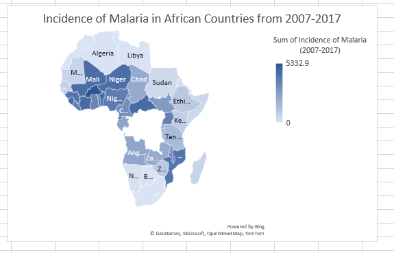
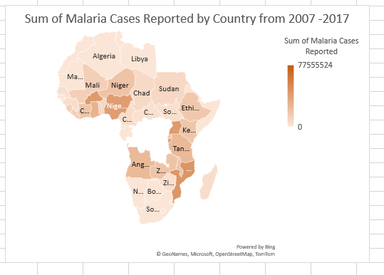
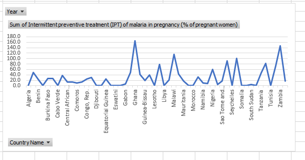
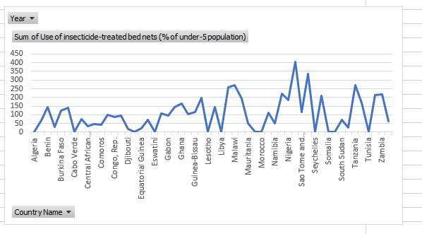
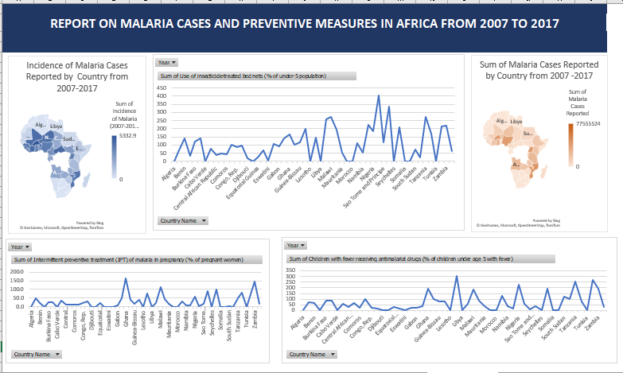

# 2007-2017 Malaria-in-Africa-Analysis-MSExcel

## Project Description ✨ 
The data was obtained from Kaggle. It's a data on Malaria in Africa from 2007 to 2017.
It shows the number of malaria cases reported and preventive measures taken within the period.

 ✍ Note: Not all the data in the dataset was used. Also, dataset was in CSV so it was converted to excel format.

 ## Analysis derived from the dataset
 - Map showing Incidence of malaria cases reported in all African countries form 2007-2017

 

 - Map showing malaria cases reported in all African countries form 2007-2017

- Pivot chart analysis with Line chart showing 
sum of children receiving with fever receiving antimalaria drugs

- Pivot chart analysis with Line chart showing 
sum of intermitent preventive treatment of malaria in pregnancy

- Pivot chart analysis with Line chart showing 
sum of use of use of insecticides treated bed nets

## Dashboard of the analysis

# Conclusion
The above analysis shows the incidence and reported cases and some of the preventive measures that were taken. 